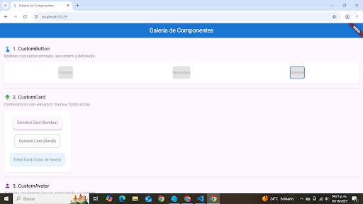

# Proyecto Flutter - Componentes Personalizados

### Autor

**Nombre:** Isaac Moctezuma Montoya  
**Matrícula:** I20223TN135

---

### Descripción del proyecto

Este proyecto incluye una colección de componentes personalizados creados con Flutter.  
El objetivo es tener widgets reutilizables con distintos estilos, como botones, alertas, tarjetas, chips, campos de texto y más.

Cada componente está construido con `StatelessWidget` y soporta diferentes variantes visuales para adaptarse a múltiples usos dentro de una aplicación.

---

### Componentes implementados

1. CustomButton  
2. CustomBadge  
3. CustomAlert  
4. CustomAvatar  
5. CustomCard  
6. CustomChip  
7. CustomInput  
8. CustomProgress

---

### Variantes de cada componente

| Componente     | Variantes                     |
| -------------- | ----------------------------- |
| CustomButton   | primary, secondary, outlined  |
| CustomBadge    | info, success, warning, error |
| CustomAlert    | info, success, warning, error |
| CustomAvatar   | circular, rounded, square     |
| CustomCard     | elevated, outlined, filled    |
| CustomChip     | standard, outlined, colored   |
| CustomInput    | standard, outlined, filled    |
| CustomProgress | linear, circular, custom      |

---

*   
  CustomButton: Muestra las variantes primary, secondary y outlined.  
  CustomCard: Tarjetas con estilo elevated y filled.

*   
  CustomAvatar: Diferentes formas de avatar (circular, rounded, square).  
  CustomBadge: Etiquetas de estado en distintos colores.

*   
  CustomChip: Chips de categorías y filtros.  
  CustomAlert: Mensajes de alerta tipo info, success y warning.

*   
  CustomInput: Campos de texto con distintos estilos.

*   
  CustomProgress: Barras de progreso lineal y circular mostrando avance de tareas.
---

### Cómo ejecutar el proyecto

1. Clonar el repositorio:

   ```bash
   git clone https://github.com/Isaac22mo/Galer-a-de-Componentes-Flutter.git

2. Entrar al directorio del proyecto:

    ```bash
    cd repositorio

3. Instalar dependencias:

    ```bash
    flutter pub get

4. Ejecutar la aplicación

     ```bash
     flutter run

---

### Versión de flutter 
 3.35.3

---

### Notas finales
Este proyecto demuestra cómo crear componentes reutilizables y personalizables en Flutter.
Cada widget tiene variantes que permiten ajustar su apariencia y comportamiento de manera sencilla, facilitando la construcción de interfaces más consistentes y modulares.